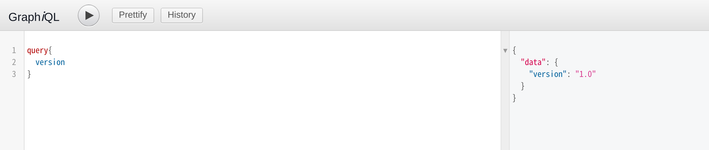
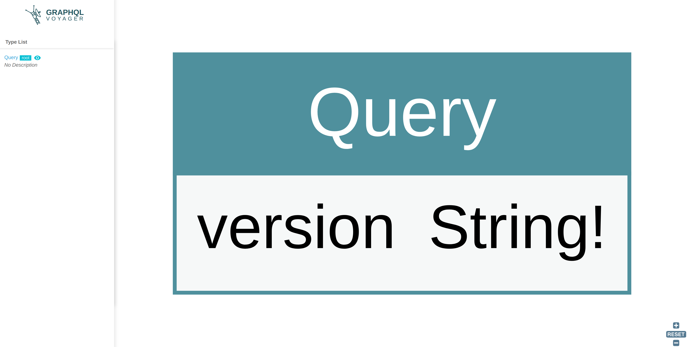

### 準備

Spring Boot

```kotlin
implementation("org.springframework.boot:spring-boot-starter-web")
implementation("org.springframework.boot:spring-boot-starter")
```

GraphQl

```kotlin
implementation ("com.graphql-java:graphql-spring-boot-starter:5.0.2")
implementation ("com.graphql-java:graphiql-spring-boot-starter:5.0.2")
implementation ("com.graphql-java:graphql-java-tools:5.2.4")
```

スキーマの依存関係を見るためのライブラリ

```kotlin
implementation ("com.graphql-java:voyager-spring-boot-starter:5.0.2")
```

### application.yml

```kotlin
graphql:
  servlet:
    mapping: /graphql
    enabled: true
    corsEnabled: true

graphiql:
  mapping: /graphiql
  endpoint: /graphql
  enabled: true
  pageTitle: GraphiQL
```

## Get Started
### スキーマを用意

`schema.graphqls`というファイルを作成

```graphql
type Query {
    version: String!
}
```

### GraphQLQueryResolver

```kotlin
@Component
class QueryResolver : GraphQLQueryResolver {
    fun version(): String {
        return "1.0"
    }
}
```

localhost:8080/graphiql



localhost:8080/voyager

